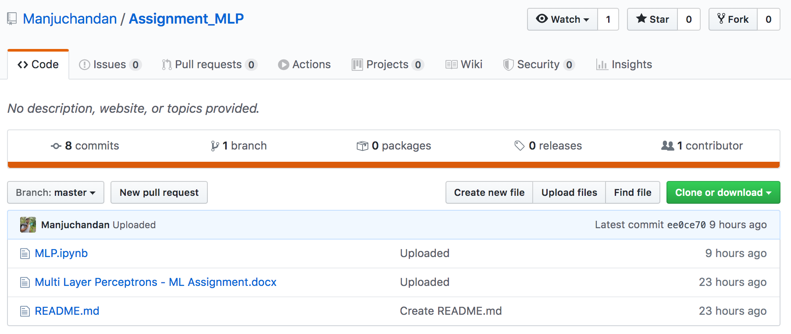

<h2> ERROR IN SUBMISSIONS </h2>
<ol> 
<li><b>Amogh Mulge - Repo is Empty <b>

<li><b>Ahmed Uddin Khalid Syed - Directory named as "MLP", instead of "Assignment_MLP" <b>

<li><b>Amogh Bagur- Directory named "Assignment_MLP" does not exist in  the repo. Instead repo is named "Assignment_MLP"<b>

<li><b>Arpitha - Directory named "Assignment_MLP" does not exist in  the repo. Instead repo is named "Assignment_MLP" <b>

<li><b>Chetan- (1) Directory named "Assignment_MLP" does not exist in  the repo.  (2) No .ipynb file in repo<b>

<li><b>Kushan- No .py file in repo. Only .ipynb exists<b>

<li><b>Manjunath -  (1) Directory named "Assignment_MLP" does not exist in  the repo. Instead repo is named "Assignment_MLP (2) No .ipynb file in repo <b>

<li><b>Manasa- (1) Directory named "Assignment_MLP" does not exist in  the repo. Instead repo is named "Assignment_MLP (2) No .ipynb file in repo <b>

<li><b>Prajwal - Directory named "Assignment_MLP" does not exist in  the repo. Instead repo is named "Assignment_MLP"<b>

<li><b> Ritesh- Directory named "Assignment_MLP" does not exist in  the repo. Instead repo is named "Assignment_MLP"<b>

<li><b>ShwethaT-(1) Git URL Submitted is incorrect (2) Directory named "Assignment_MLP" does not exist in  the repo. Instead repo is named "Assignment_MLP (3) No ".py" instead ".py.docx" exists (4) No ".ipynb" in repo <b>

<li><b>Shukla - Git Repo is private <b>

<li><b>Sowmil - Directory named "Assignment_MLP" does not exist in  the repo. Instead repo is named "Assignment_MLP" <b>

<li><b> Varshini - Gave link of the Google Response form instead of Git Repo!!!<b>

<li><b>Vivek - - Directory named "Assignment_MLP" does not exist in  the repo. Instead repo is named "Assignment_MLP" <b>

<li><b>Vibharvri - (1) Git URL Submitted is incorrect <b>

<b>Vibharvri - (2) No ".py" file (3) ",ipynb" is called "Untitled" rename to something meaningful</b>

</ol>
