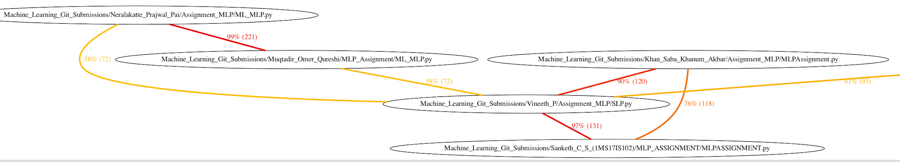

<h2><u>Plagiarism Reports Explanation</u></h2>
<b>There are THREE Reports Generated</b>
<ul>
  <li>Consolidated Report 'ConsolidatedReport_Assignment_MLP.xls' having all students seperated as individual sheets</li>
  <li>Individual Report per student saved with student name.xls</li>
  <li>Overall plagiarism similarity graph</li>
 </ul> 
 <b>PLEASE NOTE:</b>
 <ul>
 <li>For this assignment WE WILL NOT Cut the <b>2marks</b> for plagiarism</li>
 <li>We will give you folks the benifit of doubt and being subjected to a plagiarism checker</li>
  </ul>
 <ol>
  <li>
 
<b>The Consolidated Report 'ConsolidatedReport_Assignment_MLP.xls' that you see,is depicting >=50% code similarity</b>
 
  </li>
  
<b>A sample of the Consolidated Report is given below</b>

  
<b><u>Please NOTE the following:</b></u>

  <ol>
    <li>The Screenshot is a SAMPLE portion of the overall report('ConsolidatedReport_Assignment_MLP.xls')</li>
    <li>It is used here to explain the interpretation.</li>
    <li> This means that "Student A" has 50% or more similarity index with "Student B", "Student C" etc</li>
    <li>It DOESNOT indicate "who has copied from whom"</i>
    <li>Download your individual excel report from the folder "PlagiarismReports"</li>
    <li>The last column are URL that takes you to the source files where the similarity is colour coded and shown</li>
  </ol>

   
  <li>
    
<b>The Code Similarity sample looks like this</b>

    
  </li>
   
<b><u>Please NOTE the following:</b></u>

  <ol>
    <li>The Screenshot is a SAMPLE portion of code difference / similarity colour coded</li>
    <li>It is used here to explain the interpretation.</li>
    <li> Note that the variable, function name changes, adding white spaces etc will not make you escape plagiarism!!</li>
  </ol>
<li>
  
<b>The overall GRAPH that you see, 'Plagiarism 50 Percent.png' is depicting >=50% code similarity</b>
 
</li>
</ol>
  
<b>A sample of the plagiarism graph is given below</b>

  
<b><u>Please NOTE the following:</b></u>

  <ol>
    <li>The above graph is a SAMPLE portion of the overall graph('Plagiarism 50 Percent.png')</li>
    <li>It is used to explain the interpretation. Zoom and look at the overall graph for your plagiarism similarity</li>
    <li> This is an "Undirected Graph"</li>
    <li> This means that "Student A" has 50% or more similarity index with "Student B", "Student C" etc</li>
    <li>It DOESNOT indicate "who has copied from whom"</i>
  </ol>
  
